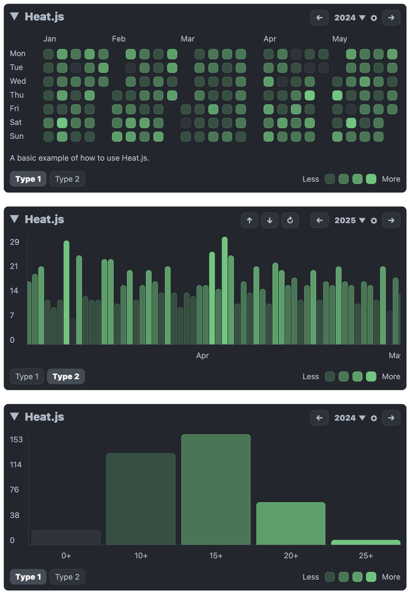

<h1 align="center">
Heat.js

[](https://twitter.com/intent/tweet?text=Heat.js%2C%20a%20free%20JavaScript%heat%20map&url=https://github.com/williamtroup/Heat.js&hashtags=javascript,heat,map)
[](https://www.npmjs.com/package/jheat.js)
[](https://www.nuget.org/packages/jHeat.js/)
[](https://github.com/williamtroup/Heat.js/blob/main/LICENSE.txt)
[](https://github.com/williamtroup/Heat.js/discussions)
[](https://github.com/williamtroup)
</h1>

> <p align="center">🌞 A lightweight JavaScript library that generates customizable heat maps to visualize date-based activity and trends.</p>
> <p align="center">v0.5.0</p>
<br />


<br>
<br>

<h1>What features does Heat.js have?</h1>

- Zero-dependencies and extremely lightweight!
- Full API available via public functions.
- Fully styled in CSS/SASS and compatible with the Bootstrap library.
- Full CSS theme support (using :root variables).
- Fully configurable per DOM element.
- Toggling colors on/off support.
- Export all data to CSV.
<br />
<br />


<h1>What browsers are supported?</h1>

All modern browsers (such as Google Chrome, FireFox, and Opera) are fully supported.
<br>
<br>


<h1>What are the most recent changes?</h1>

To see a list of all the most recent changes, click [here](docs/CHANGE_LOG.md).
<br>
<br>


<h1>How do I get started?</h1>

To get started using Heat.js, do the following steps:
<br>
<br>

### 1. Prerequisites:

Make sure you include the "DOCTYPE html" tag at the top of your HTML, as follows:

```markdown
<!DOCTYPE html>
```
<br>


### 2. Include Files:

```markdown
<link rel="stylesheet" href="dist/heat.js.css" />
<script src="dist/heat.js"></script>
```
<br>


### 3. DOM Element Binding:

```markdown
<div id="heat-map" data-heat-options="{ 'showDayNames': true }">
    Your HTML.
</div>
```

To see a list of all the available binding options you can use for "data-heat-options", click [here](docs/binding/options/OPTIONS.md).

To see a list of all the available custom triggers you can use for "data-heat-options", click [here](docs/binding/options/CUSTOM_TRIGGERS.md).

<br>


### 5. Adding Dates:

Now, you can add/remove dates, which will update the heat map automatically!

```markdown
<script>
  var newDateObject = new Date();

  $heat.addDate( "heat-map", newDateObject, false );
  $heat.removeDate( "heat-map", newDateObject, false );
</script>
```
<br>
<br>


### 5. Finishing Up:

That's it! Nice and simple. Please refer to the code if you need more help (fully documented).
<br>
<br>

<h1>How do I go about customizing Heat.js?</h1>

To customize, and get more out of Heat.js, please read through the following documentation.
<br>
<br>


### 1. Public Functions:

To see a list of all the public functions available, click [here](docs/PUBLIC_FUNCTIONS.md).
<br>
<br>


### 2. Configuration:

Configuration options allow you to customize how Heat.js will function.  You can set them as follows:

```markdown
<script> 
  $heat.setConfiguration( {
      safeMode: false
  } );
</script>
```

To see a list of all the available configuration options you can use, click [here](docs/configuration/OPTIONS.md).